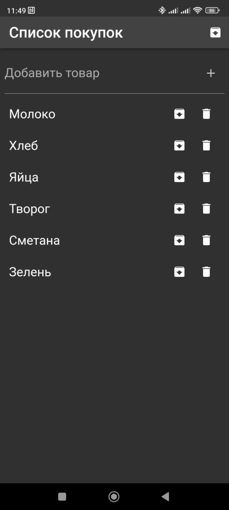

# Shopping List

The "Shopping List" app is developed using Flutter and allows users to create, edit, archive, and delete items from their shopping list.

## Key Features:
- **Add items** to your shopping list.
- **Edit items** in the shopping list.
- **Archive items** from the shopping list.
- **Delete items** from either the shopping list or the archive.
- **Toggle between the shopping list and archive** using the AppBar button.
- **Automatic saving** of the shopping list and archive on the device.
- **Supports the system theme** of the device.

## Installation and Running:

1. Clone the repository:
   cd shopping_list_app
   flutter pub get
   flutter run

## Testing:

To run tests, use the following command:
    flutter test